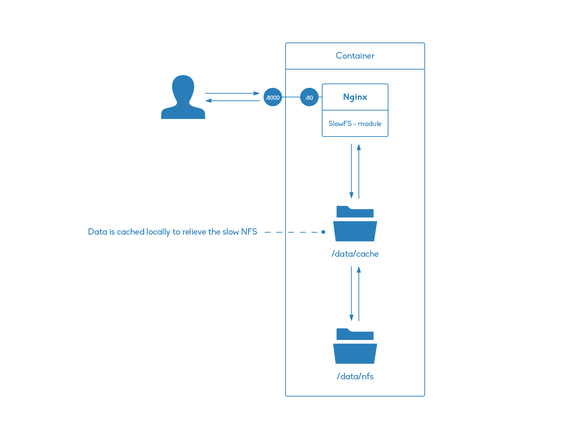

# Nginx SlowFS Module Example

This repository shows an example usage of the Nginx slowfs module.

## Overview

## Requirements

- [Docker](http://www.docker.com/)

## Setup

Build container

    docker build -t 'czerasz/nginx-slowfs' .

Run example container

    docker run \
       --rm \
       -p 8000:80 \
       -v `pwd`/nfs-dummy:/data/nfs \
       --name 'nginx_slowfs_example_container' \
       czerasz/nginx-slowfs

## Example

Test request:

    $ curl -i 'localhost:8080/test-file.txt'
    HTTP/1.1 200 OK
    Server: nginx/1.6.2
    Date: Mon, 23 Mar 2015 13:35:07 GMT
    Content-Type: text/plain
    Content-Length: 4
    Last-Modified: Mon, 23 Mar 2015 12:48:15 GMT
    Connection: keep-alive
    Accept-Ranges: bytes
    
    test

Cache file structure:

    $ docker exec nginx_slowfs_example_container tree -A /data/cache/
    /data/cache/
    └── 1
        └── 27
            └── 2bba799df783554d8402137ca199a271

Cached file content:

    $ docker exec nginx_slowfs_example_container cat /data/cache/1/27/2bba799df783554d8402137ca199a271 
    cf...=>
    KEY: /test-file.txt
    
    test

## Resources:

- [Effective caching with Nginx over NFS](http://blog.spekschoor.nl/2012/08/effective-caching-with-nginx-over-nfs.html)
- [Nginx SlowFS Cache Module](http://labs.frickle.com/nginx_ngx_slowfs_cache/)